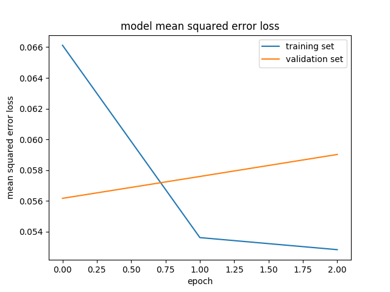
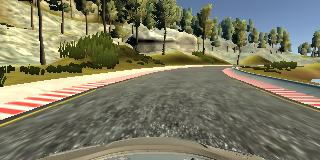
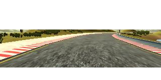

## Udacity Nanodegree Self-driving Car Engineer - Project "Behavioral Cloning"

### Goal of the project
The goal of this project is to train a neural network on images of a car driving around a track and the corresponding steering angles, such that it can then drive autonomously around the track.

### Neural network architecture and training
The project is based on the paper by [Bojarski et al.](http://images.nvidia.com/content/tegra/automotive/images/2016/solutions/pdf/end-to-end-dl-using-px.pdf) and I am using the exact same architecture as described in their paper. I then did a first training round with the data provided by Udacity. It worked not too bad, however since this data only shows the car driving in the middle of the road, it had not learned to move away from the borders of the road if by accident it came too close to them. So I needed to collect more data and train the model also on it:

* `add_data`: This is data where I drove around the track sometimes drifting off to the left or right and then re-centering
* `counter_data`: Data I collected by driving around the track in counter-clockwise direction (all the other data is clockwise). This should help the model to generalize better.
* `curve_data` and `add_curve_data` is data emphasizing on driving around the curves since this is where the car has the most difficulties not to over- or understeer.

For each data set, I used the images from the center, left and right cameras. I corrected the steering angle of the left (right) camera by adding (subtracting) a correction factor of 0.2. This is a blunt approximation, of course, but it works. Moreover, to further increase the training data I flipped each image and took the negative of the steering angle, then added it to the training set.
I used a generator to load the images and augment the data by adding flipped images on the fly while training the network. This avoids having to load a huge amount of data all at once.
I trained for three epochs since no further improvement of the validation loss was observed with more epochs.
<figure class="image">
	
	<figcaption>Loss of the training and validation sets per epoch</figcaption>
<figure>

### Data preprocessing
To preprocess the data I cropped the upper 60 lines of pixels where trees, electricity lines and other objects that would only distract the network where seen by the camera. I also cropped the lower 25 lines of pixels where the hood is seen in the camera image.
<figure class="image">
	
	<figcaption>Example of a camera image before cropping</figcaption>
</figure>
<figure class="image">
	
	<figcaption>The same image after cropping</figcaption>
</figure>

Furthermore, I normalized each image to a range between 0 and 1 and mean-centered it.

### Files submitted
My project contains the following files:

- model.py: Main file of the code, to be run in order to define and train the model on input data
- model.h5: the trained model used for driving the car in autonomous mode
- data_generator.py: generator to load and preprocess the training and validation data on the go - called by model.py
- data_set.py: defines a class for input data sets (I used several data sets to construct the training and validation data, so defining a class to handle them made sense).
- drive.py: provided by Udacity, used to drive the car in autonomous mode
- read_images.py: helper functions to read in images
- sample.py: class for one "sample" of input data: consisting of the information in one line in the csv-file, the path to the folder where the corresponding images are stored and the correction factor for left and right camera images.
- run1.mp4: A video of the car running around the track in autonomous mode

